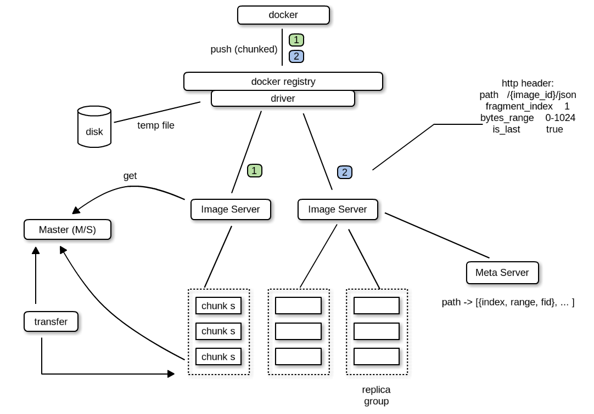

Introduction
============

Speedy is a high performance distributed docker image storage solution written by go/c. It can be easily scaled out by adding more storage instance and no data have to move around between storage instance.It is also production ready and used by [jcloud.com](http://jcloud.com).

Features
============
* High performance and efficient file storage engine written by c.
* High availability by multi copy of storage instance and stateless frond-end proxy image server.
* High controllability by introduce weak central master node. The upload/download process will not go through the master node.
* High scalability by dynamically adding more storage instance and frond-end proxy image server.
* Large file will be divided into small chunks and upload/download those chunks concurrently.
* Onboard storage monitoring system.
* Onboard rich operation tools.
* Docker registry 1.0 API are supported.

Upcoming Features
============
* Online data transfer system.
* Docker registry 2.0 API support.
* General object storage system interface like S3/Swift.
* More operation tools.

Architecture
============

Component
============
* docker-registry-speedy-driver       
Docker-registry backend storage driver for speedy, It divides docker image layer into fixed-size chunk and uploads/downloads concurrently .

* imageserver            
It is a stateless frond-end proxy server designed to provide restful api to upload and download docker image. 
imageserver get chunkserver information and file id from chunkmaster periodically. 
imageserver choose a suitable chunkserver group to storage docker image according to chunkserver information independently, 
we can start many imageserver to provice service at the same time and docker-registry-speedy-driver can use anyone of them equally.

* chunkmaster              
It is a central master node designed to maintain chunkserver information and allocate the file id. 
chunkmaster store chunkserver information to mysql and keep in memory as cache, while imageserver try to get chunkserver information chunkmaster send the information in memory to imageserver.
while imageserver try to get file id, chunkmaster allocate a continuous range of file id and send to imageserver.

* chunkserver             
It is a highly optimized storage engine for performance and space efficiency.It appends single small image file into large files and maintain file index in memory keeping the IO overhead to a minimum. Normally, a chunkserver group is consist of 3 chunkservers, imageserver writes data to a chunkserver group suceess means storing data to each chunkserver of the group success. 

* metaserver        
It is an another distributed key-value storage used by [jcloud.com](http://jcloud.com), since It's not open-source yet, you can use mysql instead which store the image layer metadata informations.

Quick Install
=============
we will demonstrate how to install speedy in one host  
assume the work directory is test 
mkdir /test  
mkdir -p /test/chunkmaster
mkdir -p /test/imageserver
mkdir -p /test/chunkserver
mkdir -p /test/registry

* how to make        
cd speedy
./bootstrap.sh
. ./dev.env
make

cp bin/chunkmaster /test/chunkmaster
cp bin/imageserver /test/imageserver
cp bin/spy_server /test/chunkserver
cp docker_registry/docker-registry-0.9.0.tar.gz /test/registry
cp docker_registry/docker-registry-core-2.0.3.tar.gz /test/registry
cp -r docker_registry_speedy_driver/ /test/registry

* metaserver(database)   
install mysql
create database speedy //used by chunkmaster
create table gen_fid
insert into gen_fid values(1, now(), now()); //init gen_fid and insert a record, set the init fid=1 (not 0)
create table table_chunkserver

create database metadb //used by imageserver
create table key_list

* chunkmaster   
./chunkmaster --help
Usage of ./chunkmaster:       
  -D=false: log debug level      
  -d="speedy": database name       
  -dh="127.0.0.1": database ip     
  -dp="3306": database port       
  -h="0.0.0.0": chunkmaster listen ip      
  -p=8099: chunkmaster listen port       
  -pw="": database passwd      
  -u="root": database user       
cd /test/chunkmaster      
./chunkmaster //use default param       

init chunkserver      
vim serverlist.json     
example:      
init one group:           
[     
{"GroupId":1,"Ip":"127.0.0.1","Port":7654},      
{"GroupId":1,"Ip":"127.0.0.1","Port":7655},      
{"GroupId":1,"Ip":"127.0.0.1","Port":7656}      
]      
call init api of chunkmaster by curl      
curl -i -X POST --data @serverlist.json "http://127.0.0.1:8099/v1/chunkserver/batchinitserver"       

if you want to add two groups, the example of two groups's json:    
[     
{"GroupId":1,"Ip":"127.0.0.1","Port":7654},      
{"GroupId":1,"Ip":"127.0.0.1","Port":7655},      
{"GroupId":1,"Ip":"127.0.0.1","Port":7656},     
{"GroupId":2,"Ip":"127.0.0.1","Port":7664},     
{"GroupId":2,"Ip":"127.0.0.1","Port":7665},      
{"GroupId":2,"Ip":"127.0.0.1","Port":7666}      
]     

* chunkserver   
mkdir -p /test/chunkserver/group-1/chunkserver-7654      
mkdir -p /test/chunkserver/group-1/chunkserver-7655      
mkdir -p /test/chunkserver/group-1/chunkserver-7656      
mkdir -p /test/chunkserver/log-group-1      

cd /test/chunkserver        
./spy_server -h 127.0.0.1 -p 7654 -w /test/chunkserver/group-1/server-7654 -e /test/chunkserver/log-group-1/chunkserverlog-7654 -s 1 -l 200 -n 5 -m 127.0.0.1 -r 8099 -d
./spy_server -h 127.0.0.1 -p 7655 -w /test/chunkserver/group-1/server-7655 -e /test/chunkserver/log-group-1/chunkserverlog-7655 -s 1 -l 200 -n 5 -m 127.0.0.1 -r 8099 -d
./spy_server -h 127.0.0.1 -p 7656 -w /test/chunkserver/group-1/server-7656 -e /test/chunkserver/log-group-1/chunkserverlog-7656 -s 1 -l 200 -n 5 -m 127.0.0.1 -r 8099 -d

* imageserver    
./imageserver      
Usage of ./imageserver:      
  -D=false: log debug level     
  -db="metadb": meta database      
  -dh="127.0.0.1": metadb ip     
  -dp=3306: metadb port     
  -h="0.0.0.0": imageserver listen ip      
  -mh="127.0.0.1": chunkmaster ip      
  -mp=8099: chunkmaster port     
  -n=2: the limit num of available chunkserver each chunkserver group     
  -p=6788: imageserver listen port     
  -pw="": metadb password    
  -u="root": metadb use      

cd /test/imageserver     
./imageserver //use default param     

* docker-registry/speedy-driver       

maybe need to install python-pip, python-devel or liblzma depend on your environment      

cd /test/registry     
tar xvf docker-registry-core-2.0.3.tar.gz     
cd docker-registry-core-2.0.3      
python setup.py install     

tar xvf docker-registry-0.9.0.tar.gz    
cd docker-registry-0.9.0    
python setup.py install     

cd docker-registry-speedy-driver         
python setup.py install     

cp config_sample.yml  config.yml   
vim dev.env     
export GUNICORN_WORKERS=16     
export SETTINGS_FLAVOR=speedy     
export SPEEDY_TMPDIR=/test/registry/temp //speedy use this dir to storage temp file    
export DOCKER_REGISTRY_CONFIG=/test/registry/docker_registry_speedy_driver/config.yml      

docker-registry //start docker-registry      

Startup sequence
================
1.chunkmaster   
2.chunkserver   
3.metaserver(mysql)       
4.imageserver   
5.docker-registry   

After that you can push and pull docker images.

Performance Test
================

We made a performance test about upload and download of Speedy. We use 4 normal servers   
(CPU: 24 core 2G HZ; Memory: 16G; Disk: 300G 10k SAS; Ethernet: 1 Gigabit) to construct   
our test environment. 

                           imageserver [node1]
                        /          |           \
                       /           |            \
        chunk-server[node2] chunk-server[node3] chunk-server [node4]

We simply use mysql instead of our internal MetaServer, at the same time,    
chunkserver is on the default buffer io model.

+ Performance Results

<table>
<tr><td> concurrent &nbsp;</td><td> fileSize(M)&nbsp; </td><td> file count&nbsp; </td><td> upload time(seconds)&nbsp; </td><td> download time(seconds)&nbsp; </td><td> upload speed(M/s)&nbsp; </td><td> download speed(M/s)&nbsp; </td></tr>
<tr><td> 10         </td><td> 16          </td><td> 100        </td><td> 42.85                </td><td> 15.23                  </td><td> 37.34        </td><td> 105.06 </td></tr>
<tr><td> 50         </td><td> 16          </td><td> 100        </td><td> 42.82                </td><td> 16.29                  </td><td> 37.37        </td><td> 98.22 </td></tr>
<tr><td> 100        </td><td> 16          </td><td> 100        </td><td> 45.69                </td><td> 14.50                  </td><td> 35.02        </td><td> 110.34 </td></tr>
<tr><td> 10         </td><td> 16          </td><td> 500        </td><td> 214.14               </td><td> 72.45                  </td><td> 37.36        </td><td> 110.42 </td></tr>
<tr><td> 50         </td><td> 16          </td><td> 500        </td><td> 213.90               </td><td> 71.40                  </td><td> 37.40        </td><td> 112.04 </td></tr>
<tr><td> 100        </td><td> 16          </td><td> 500        </td><td> 213.92               </td><td> 71.51                  </td><td> 37.40        </td><td> 111.87 </td></tr>
<tr><td> 10         </td><td> 16          </td><td> 1000       </td><td> 427.97               </td><td> 147.78                 </td><td> 37.39        </td><td> 108.27 </td></tr>
<tr><td> 50         </td><td> 16          </td><td> 1000       </td><td> 427.79               </td><td> 146.62                 </td><td> 37.40        </td><td> 109.13 </td></tr>
<tr><td> 100        </td><td> 16          </td><td> 1000       </td><td> 427.80               </td><td> 142.81                 </td><td> 37.40        </td><td> 109.13 </td></tr>
</table>

We can easily got that download speed reach the limit of Ethernet, about 110 M/s.    
Although upload speed looks like just 1/3 of download speed, acctually upload also    
reach the Ethernet limit, that is the result of upload will concurrently write three   
chunkservers.
